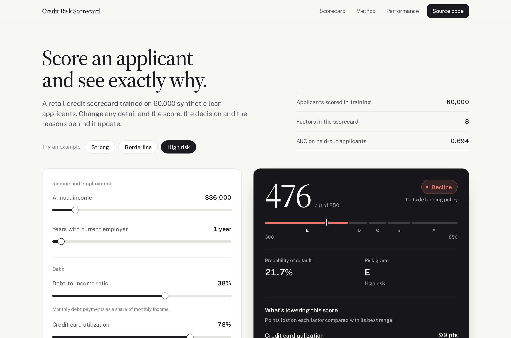
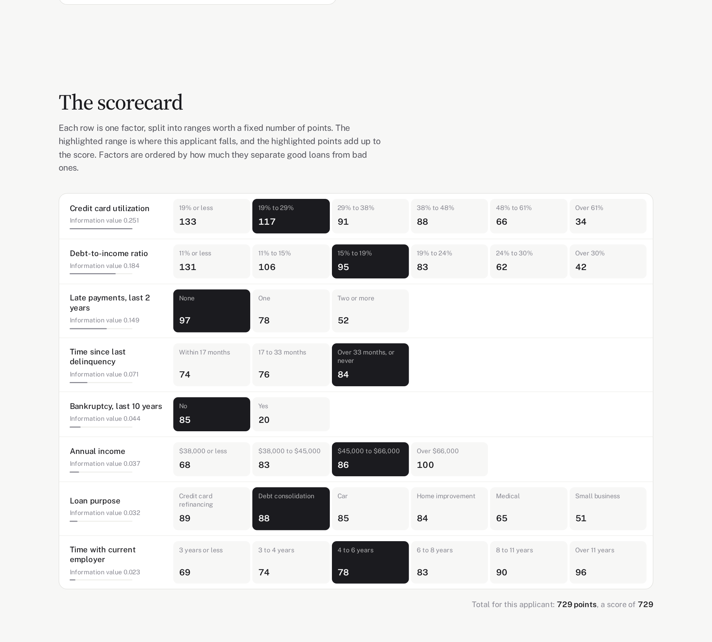
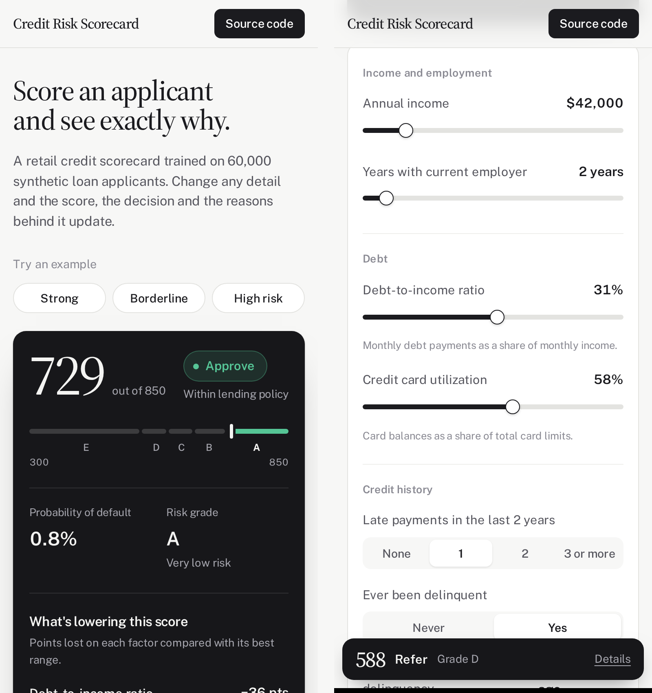

# Credit Risk Scorecard

[](https://github.com/omarja12/credit-risk-scoring/actions/workflows/ci.yml)
[](LICENSE)

**[Try the live demo](https://omarja12.github.io/credit-risk-scoring/)**

A retail credit scorecard built the way lenders build them: Weight-of-Evidence
binning, logistic regression, and a points-based score from 300 to 850. The
web app scores an applicant as you type and shows the decision, the risk grade,
and exactly which factors cost them points.

[](https://omarja12.github.io/credit-risk-scoring/)

> All data is synthetic, generated by `data/generate_data.py`. No real applicant
> records and no proprietary code, data, or models from any employer are used.

## Why a scorecard

A lender has to explain every decline. US adverse action rules require stating
the principal reasons, and EU rules give applicants a right to an explanation of
automated decisions. A black-box model with a higher AUC is often not
deployable when nobody can say why a particular applicant was turned down.

A scorecard answers that directly. Each input falls into a range worth a fixed
number of points, and the points add up to the score. In the demo, the high-risk
example loses 99 points on credit card utilization (78%, where full points need
19% or less) and 89 on debt-to-income (38%, where full points need 11% or less).



## What's in it

- **Monotonic WOE binning with Information Value screening.** Continuous
  features start from quantile bins, and neighbouring bins are merged until risk
  moves in one direction only, so earning more never costs points. Discrete
  features get business bins (0 / 1 / 2+ late payments). Factors below IV 0.02
  are dropped: 8 of 14 candidates remain.
- **Logistic regression on WOE features**, fitted on the training split only
  so the binning can't leak test information.
- **PDO scaling**: 600 points at 20:1 odds, 50 points to double the odds.
  Scoring through the points table ranks applicants identically to the model,
  and the training script checks it.
- **Grades defined on probability of default**, so a grade can never contradict
  the PD next to it, plus an illustrative policy: approve below 5% PD, refer to
  an underwriter at 5–10%, decline above 10%.
- **Reason codes**: the factors losing the most points against their best range,
  with the applicant's value and what earns full points.
- **A static web app** with no server. The Python pipeline exports the points
  table to JSON and the browser only looks points up, so the two can't drift
  apart. A test scores all 15,000 held-out applicants in both Python and
  JavaScript and checks they agree.
- **CI and deployment**: GitHub Actions retrains the model, runs the tests on
  Python 3.10 and 3.12, and publishes the site to GitHub Pages on every push.

## Results

Measured on 15,000 held-out applicants (45,000 used for training, 2.6% default rate).

| Metric | Value |
|---|---|
| AUC | 0.694 |
| Gini | 0.389 |
| KS | 0.305 |

Grades rank-order risk, and predicted default rates match what actually
happened in each band:

| Grade | Share of applicants | Predicted default rate | Actual default rate |
|---|---|---|---|
| A | 21% | 0.7% | 0.9% |
| B | 43% | 1.7% | 1.7% |
| C | 25% | 3.5% | 3.6% |
| D | 9% | 6.6% | 6.6% |
| E | 2% | 12.8% | 9.0% |

Real application scorecards usually reach an AUC between 0.65 and 0.75. The
synthetic data deliberately contains noise the model can't explain, so these
numbers are believable rather than flattering.

| Factor | Information value |
|---|---|
| Credit card utilization | 0.251 |
| Debt-to-income ratio | 0.184 |
| Late payments, last 2 years | 0.149 |
| Time since last delinquency | 0.071 |
| Bankruptcy, last 10 years | 0.044 |
| Annual income | 0.037 |
| Loan purpose | 0.032 |
| Time with current employer | 0.023 |

## The maths

```
WOE      = ln( share of good loans in bin / share of bad loans in bin )

Factor   = PDO / ln(2)
Offset   = BaseScore − Factor × ln(BaseOdds)
points_i = −(WOE_i × coef_i + intercept / n) × Factor + Offset / n
```

## On a phone

The decision comes first, and a slim bar keeps the score in view while you
adjust the inputs.



## Run it locally

```bash
git clone https://github.com/omarja12/credit-risk-scoring.git
cd credit-risk-scoring
pip install -r requirements.txt

python data/generate_data.py    # 60,000 synthetic applicants
python src/train.py             # bin, fit, scale to points, evaluate
python src/export_web.py        # write the points table for the site
python -m http.server -d site   # open http://localhost:8000
```

Run the tests with `pytest tests/ -v`. The parity test needs Node.js.

## Publish your own copy

Push to GitHub, then go to **Settings → Pages** and set the source to
**GitHub Actions**. Every push to `main` then retrains, tests, and redeploys
the site.

## Project structure

```
credit-risk-scoring/
├── data/generate_data.py      synthetic applicant generator
├── src/
│   ├── woe_binning.py         monotonic WOE binning and Information Value
│   ├── scorecard.py           points scaling, grades, decisions, reason codes
│   ├── train.py               training pipeline
│   ├── export_web.py          points table for the site
│   └── evaluate.py            ROC and score distribution plots
├── site/                      static web app (HTML, CSS, JavaScript)
├── tests/
│   ├── test_scorecard.py      binning and scorecard maths
│   └── test_web_parity.py     browser scores match Python
├── docs/screenshots/
└── .github/workflows/ci.yml   test, then deploy to GitHub Pages
```

## Next steps

- Population Stability Index to monitor score drift after deployment
- Reject inference for declined applicants, whose outcomes are never observed
- A gradient boosting challenger to measure what interpretability costs

## About

Built by [Omar Ja](https://github.com/omarja12). I build credit risk models, scorecards and interpretable
machine learning for lenders and fintechs, from data preparation to a working
decision tool.

Available for freelance projects. More of my work: [github.com/omarja12](https://github.com/omarja12?tab=repositories)

## License

MIT. See [LICENSE](LICENSE). Fonts in `site/fonts` are under the SIL Open Font License.
